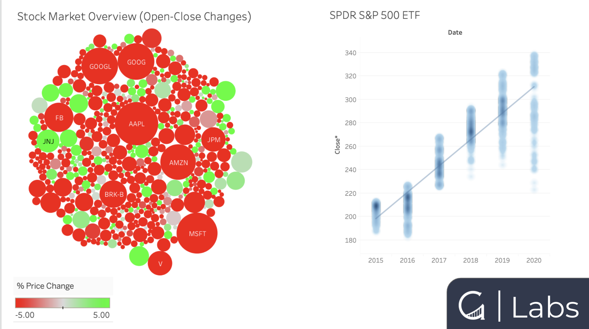

## Python Scraper
Scraping stock data from a Yahoo Finance
- Open/Close Stocks Prices
- 

Install the requirements:
 ```bash
pip install -r requirements.txt
```
Run using python 3.7
 ```bash
python3 scraper.py
```

